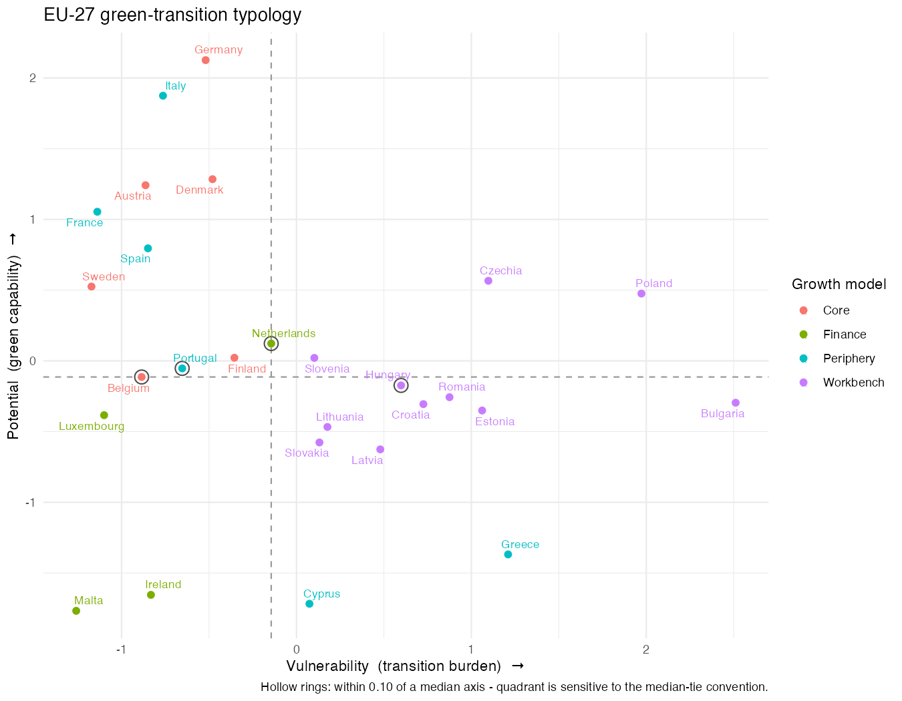
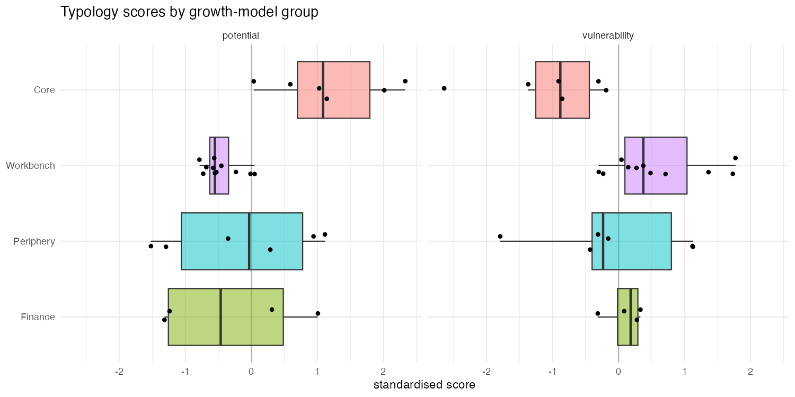
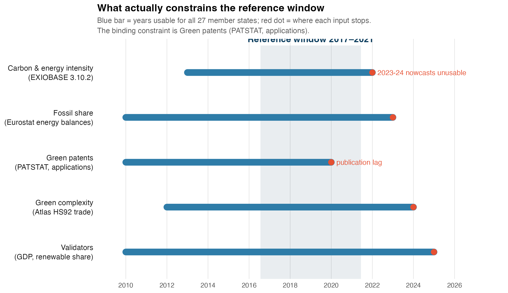
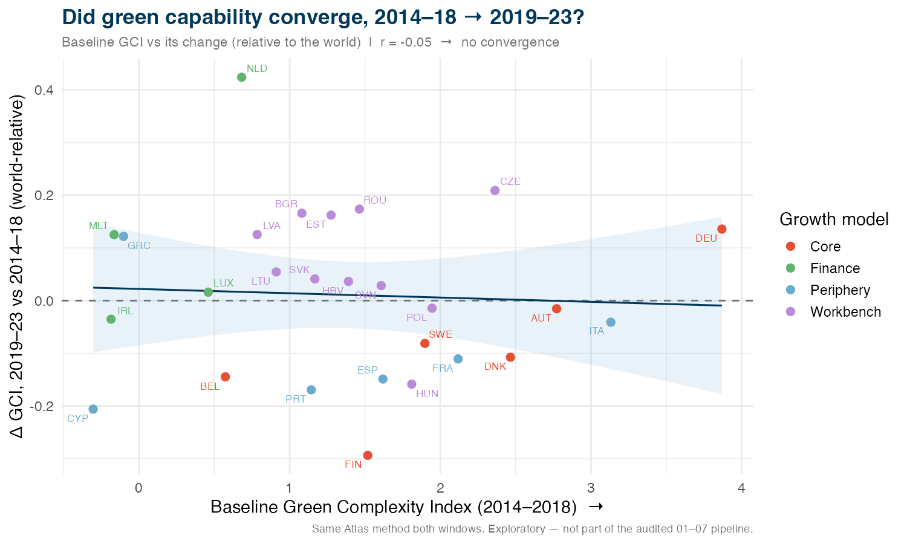
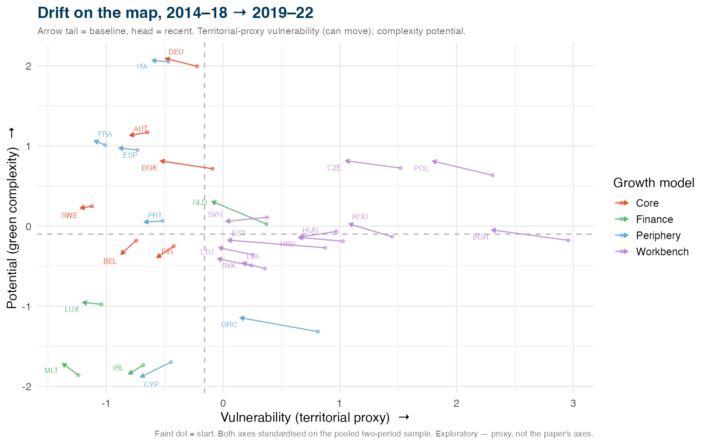

## The question {.smaller}

*Does the green transition reinforce economic polarization across the EU-27?*

::: {.fragment}
- Two things matter, and they pull apart:
  - **Vulnerability** — how exposed is the current economy?
  - **Potential** — how capable of *green* production?
:::

::: {.fragment}
- Core worry: [the transition burden falls on the catch-up East]{.accent} — the countries least able to turn it into green opportunity → convergence stalls, **polarization deepens**
:::

::: {.notes}
The OPUS question is about polarization / divergence. The mechanism of concern: the green transition imposes the largest adjustment costs on the catch-up periphery and East — carbon-intensive, fossil-reliant, export-oriented economies — exactly the group that had been slowly converging toward the core. If they bear the burden without the green capability to offset it, catch-up stalls and the core–periphery gap widens.

Two-sided reading of the map that follows: (1) the headline worry is the "At risk" group — high burden, low capability, mostly poorer East/South — they pay the cost without the means to benefit. (2) A subtler case is "Exposed but capable" (CZ, PL, SI, NL): also carbon-locked, but with real green production capability, so for them the transition *could* become an opportunity if that capability is mobilised. So "burden and opportunity on the same countries" is the nuance — the main worry is threatened convergence.
:::

---

## Where we started — and why it failed {.smaller}

::: {.columns}
::: {.column width="55%"}
**Naïve approach**

- One Ward clustering
- All per-capita indicators pooled
- Single Euclidean distance
:::
::: {.column width="45%"}
**What came out**

- Just [GDP per capita]{.accent}
- Rich North vs poorer East–South
- Nothing new
:::
:::

::: {.fragment}
> Scale dominates → clusters reproduce the known core–periphery split
:::

::: {.fragment .accent}
Need a design that is *income-neutral by construction*.
:::

::: {.notes}
Mechanisms behind the failure:

- Per-capita indicators are *levels*; their variance is dominated by economic development — richer countries score high on many indicators at once.
- Pooling every indicator into one Euclidean distance lets the single axis of largest variance drive the clustering. Here that axis is essentially GDP per capita.
- So countries group by how rich they are: the dendrogram reproduces the rich-North / poorer-East–South split we already knew (core–periphery).
- Nothing is added beyond a development ranking — not publishable, and it cannot even speak to the *green* question.
- Fix: build axes from *intensities* (per value added, so scale cancels) and from a capability measure constructed orthogonal to income.
:::

# The approach

## Design: two vulnerabilities × two potentials {.smaller}

A country's transition position has two distinct faces — keep them as **separate axes**, not one pooled distance

::: {.columns}
::: {.column width="50%"}
### Vulnerability {.muted}
*Transition burden — per value added (income-neutral)*

- Carbon intensity — GHG / value added
- Energy intensity — energy / value added
- Fossil share of primary energy
:::
::: {.column width="50%"}
### Potential {.muted}
*Green capability*

- Green patents per capita
- **Green Complexity Index (GCI)**
- **Green Complexity Potential (GCP)**
:::
:::

::: {.fragment}
Each block → one **PC1 score** → place EU-27 on a **2-D map**

[PC1 = first principal-component score — the single weighted mix of a block's variables capturing the most shared variation]{.muted}
:::

::: {.muted style="font-size:0.7em"}
Data (2014–2018 average): EXIOBASE footprints · Eurostat energy balances · PATSTAT green patents · Atlas HS92 trade
:::

::: {.notes}
PCA on a block's (standardised) variables finds the linear combination along which countries vary most — the first principal component, PC1 — and gives each country a scalar score on it. It is a data-driven way to collapse three correlated indicators into one summary axis without hand-picking weights; we orient the sign so higher = more vulnerable / more capable. We prefer PC1 to a plain average because it weights variables by how much shared signal they carry — though robustness shows the simple-mean version gives essentially the same map.
:::

---

## The key ingredient: green economic complexity {.smaller}

Mealy & Teytelboym (2022) — *what a country can competitively **make green**, not how rich it is*

::: {.columns}
::: {.column width="55%"}
- Recompute ECI / PCI / **GCI / GCP** from **Atlas HS92** trade (global set, pooled 2014–2018)
- Green HS6 product list (OECD CLEG, 244 codes)
- Extract EU-27
:::
::: {.column width="45%"}
::: {.fragment}
**Validated**

- GCI #1 = Germany · Italy · Austria · Denmark · Czechia …
- reproduces Mealy Fig. 3
- cor(GCI, ECI) = 0.78
:::
:::
:::

::: {.fragment .accent}
GCI is orthogonal to income (R² ≈ 0.01) — adds signal beyond a development ranking.
:::

::: {.notes}
Not our invention — green economic complexity is Mealy & Teytelboym (2022). Our part is to apply it to the EU-27 polarization question and to compute it ourselves from raw Atlas HS92 trade data: ECI/PCI capture how diversified and exclusive an export basket is; GCI/GCP restrict that logic to a green-product list, so they measure how well-placed a country is to *make* the goods the transition needs.

Why only through 2018: the taxonomy is pinned to one reference window, 2014–2018 — the most recent period where all other sources overlap with good coverage (EXIOBASE footprints, Eurostat energy balances, PATSTAT patents, GDP). Complexity is pooled over the same window so every indicator describes the same period. The Atlas trade data itself runs to 2024, so this is a consistency choice, not a data limit — and shifting the window (2013–17 / 2015–19) changes no quadrant (robustness slide).
:::

---

## The go / no-go check {.smaller}

Before trusting the 2-D map — are the axes *real*, or both GDP in disguise?

::: {.columns}
::: {.column width="50%"}
**Axes independent**

- cor(vulnerability, potential) = **−0.19**
:::
::: {.column width="50%"}
**Potential ≠ income**

- R² vs log GDP p.c. = **0.07**
- ≤ 0.19 leave-one-out
:::
:::

::: {.fragment}
- Vulnerability *does* track income (R² = 0.50) — read as **substantive**: catch-up economies are more carbon-intensive
:::

::: {.fragment .accent}
✓ Passed → the 2-D structure is **not** reducible to GDP.
:::

::: {.notes}
"Go/no-go" = a decision gate set *before* building the map. The design only works if the two axes carry different information, so we pre-committed to two tests: (1) are the axes independent of each other? (2) is potential independent of income? If either failed, the 2-D map would collapse to 1-D — a relabelled GDP ranking — and we would abandon the design.

Income neutrality = "not a proxy for GDP per capita". We regress each score on log GDP p.c. and read the R² (share of the score explained by income). Potential R² = 0.07 → income explains almost none of it. It matters because if potential were just income, the taxonomy would add nothing beyond "richer = greener", and the core policy claim (a poorer country can still be green-capable) would collapse.

Leave-one-out (the 0.19): the R² = 0.07 uses all 27 countries. To rule out one influential country driving the result, we refit dropping each country in turn (27 refits) and take the largest R². That maximum is 0.19, only when Luxembourg is dropped — still low. So independence is not an artefact of a single outlier.

Substantiating "not reducible to GDP": the two conditions together — axes near-orthogonal (−0.19) and potential ≈ income-free (0.07, ≤0.19 LOO) — mean the map cannot be recovered from a single income ranking. Vulnerability *does* track income (R² = 0.50), but that is substantive (catch-up economies really are more carbon-intensive), not an artefact, because it is built from per-value-added intensities, not levels.
:::

# Key results

## The typology map {.smaller}

::: {.columns}
::: {.column width="62%"}

:::
::: {.column width="38%"}
Four quadrants:

- [**Winners**]{.accent} — low burden, high capability
- **Exposed but capable**
- **At risk** — high burden, low capability
- **Low-stakes** — low burden, low capability [(finance-driven)]{.muted}

::: {.fragment}
Colour = growth model
:::
:::
:::

::: {.muted style="font-size:0.72em"}
Growth models (Gräbner et al. 2020, an *independent* classification): **Core** = export-led manufacturing · **Periphery** = demand-led / tourism (South) · **Workbench** = FDI-assembly (East) · **Finance** = financial & tax hubs
:::

::: {.notes}
The colour overlay is an *external* classification of EU growth models (Gräbner et al. 2020) — the taxonomy does not use it as an input; it serves only to read the map and, later, to validate it. Core = high-tech export-led manufacturing (DE, AT, SE…); Periphery = domestic-demand / tourism-driven, mostly Southern (ES, IT, EL, PT, FR, CY); Workbench = the Eastern "extended workbench", FDI-driven assembly (PL, CZ, HU, SK, RO, BG, HR, SI, Baltics); Finance = small financial / tax-hub economies (LU, IE, MT, NL).
:::

---

## The polarization tension {.smaller}

::: {.columns}
::: {.column width="50%"}
::: {.callout-warning appearance="minimal"}
**Exposed but capable**
**CZ · PL · SI · NL**
:::
Carbon-locked *and* green-capable — burden and opportunity on the **same** countries
:::
::: {.column width="50%"}
::: {.callout-warning appearance="minimal"}
**At risk**
**BG · RO · Baltics · HR · SK · EL · CY · HU**
:::
High burden, low capability — the tail most in need of support
:::
:::

::: {.fragment}
- **Winners** (10): DE DK AT FR SE IT ES FI PT BE
- **Low-stakes**: LU IE MT — [rich via finance, not productive activity → little at stake either way]{.muted}
- Catch-up **East** carries the burden — but is *not* uniformly low-potential
:::

::: {.notes}
Low-stakes = Luxembourg, Ireland, Malta — the "Finance" growth model. They sit low on *both* axes: low vulnerability because they have little carbon-intensive production to decarbonise, and low potential because they have little green productive capability. Their wealth comes from finance and tax-driven activity rather than from making things — so the transition is neither a large threat nor a large opportunity. High GDP, but little at stake — hence "low-stakes", and a clear illustration of why an income-based taxonomy would mis-rank them.

On the tension: "At risk" (high burden, low capability, poorer East/South) is the main polarization worry. "Exposed but capable" (CZ, PL, SI, NL) is the subtler one — burden and green opportunity on the same countries.
:::

---

## Green complexity flips the income story {.smaller}

::: {.columns}
::: {.column width="55%"}
- Catch-up **East outranks** high-GDP finance economies on GCI:
  - Czechia, Poland, Hungary, Slovenia
  - **>** Luxembourg, Ireland, Netherlands
:::
::: {.column width="45%"}
::: {.fragment}
> The green *opportunity* is not where the money is.
:::
:::
:::

::: {.fragment}
This is the whole point: a rich/poor axis would have missed it entirely.
:::

# Validation

## External validity {.smaller}

The potential axis predicts *independent* green outcomes — net of GDP p.c.

| Predictor → outcome | Partial correlation |
|---|---|
| Potential → renewable share (Eurostat SHARES) | **+0.43** |
| Potential → OECD EPS policy stringency | **+0.42** |
| Vulnerability → renewable share / GDP growth | ≈ 0 (placebo) |

::: {.fragment .muted}
EPS validator covers only 20/27 (OECD members) — silent on the low-potential tail.
Validators enter *neither* block → no circularity.
:::

::: {.notes}
"Partial correlation net of GDP p.c." — correlate score and outcome after removing the part of each explained by income, so we are not merely re-detecting that richer countries are greener.

The vulnerability row is a discriminant / placebo check. We *want* the green-outcome signal to come specifically from the potential axis. Potential predicts renewable share (+0.43) and policy stringency (+0.42). Vulnerability, by contrast, has essentially no partial correlation with renewable share (−0.04) or GDP growth (−0.08) — "≈ 0". So the predictive content is specific to potential (green performance), while vulnerability measures exposure, as intended.

Notable aside: potential correlates *negatively* with recent GDP growth (partial −0.49) — the green-capable incumbents are mature, slower-growing economies, while the fast-growing catch-up East is lower-potential. The polarization tension again.
:::

---

## Consistent with European growth models {.smaller}

::: {.columns}
::: {.column width="60%"}

:::
::: {.column width="40%"}
- **Workbench** (catch-up East): vulnerability **+1.60** (p<0.001), potential **−1.03** (p<0.05) vs Core
- Quadrant × growth-model **Cramér's V = 0.71**
- Matches the prior expectation: catch-up East is more exposed *and* less capable
:::
:::

::: {.notes}
How the scores are computed (recap): for each block, standardise its variables (vulnerability: three per-value-added intensities — carbon intensity, energy intensity, fossil share; potential: green patents p.c., GCI, GCP) to mean 0 / SD 1, run PCA, take PC1 as the block score, sign-oriented so higher = more vulnerable / more capable. Each country gets one vulnerability and one potential score — the axes of the map and the values in these boxplots.

The boxplots group those scores by the Gräbner et al. (2020) growth-model classification (Core, Periphery, Workbench, Finance) — an *external* grouping the taxonomy never used as input. Workbench (catch-up East) is significantly more vulnerable (+1.60, p<0.001) and less capable (−1.03, p<0.05) than Core; Cramér's V = 0.71 measures how strongly the four quadrants line up with the four growth models. This is the "different growth models face different transition challenges" finding — the paper's central question.
:::

---

## Robust {.smaller}

::: {.columns}
::: {.column width="50%"}
**Barely moves**

- Window shift 2013–17 / 2015–19 → **0 quadrant changes**
- GCI year-to-year rank corr ≥ 0.97
- Survives PCA-vs-mean, variable drops, outlier removal
:::
::: {.column width="50%"}
**Design choices confirmed**

- Only median/MAD rescaling shifts it (patent skew, not green signal)
- Discrete clusters weak (silhouette ≈ 0.28, gap k=1)
- → continuous **map** beats hard clusters
:::
:::

---

## Where it could break — for discussion {.smaller}

::: {.columns}
::: {.column width="50%"}
**Measurement**

- Green list = OECD CLEG (244 codes); the authors' 293-code list may shift GCI
- Green patents skewed toward small states — the one input whose rescaling moves the map
- Vulnerability still tracks income (R² = 0.50): substantive, or residual confound?
:::
::: {.column width="50%"}
**Inference & coverage**

- n = 27 → association indices + Monte-Carlo, not large-sample tests
- Borderline cases on the medians (NL, BE) flip quadrant under the tie convention
- Policy validator (OECD EPS) misses 7/27 — most of the "At risk" tail
- Window ends **2019** (EXIOBASE cap) — not the current decade
:::
:::

::: {.notes}
This slide is the invitation to push back. The most consequential ones:
- Green-product list: we use the OECD CLEG (244 HS6 codes); Mealy & Teytelboym's authoritative 293-code list is pending — GCI could move, though renewable-only GCI already correlates 0.96 with ours.
- The vulnerability↔income R² = 0.50 is the honest tension: we read it as substantive (catch-up economies really are carbon-intensive), but a reviewer could argue it is a residual income confound. Worth a clear defense in the paper.
- Coverage/date: the whole map is a 2014–2018 average because EXIOBASE value added (the denominator of both intensities) ends 2019. Extending toward 2024 means giving up the consumption-based footprint and/or the green-patent variable (patent-lag truncation) — a redefinition, not a re-dating.
- Small n: with 27 countries, everything is descriptive association (Cramér's V, partial correlations, Monte-Carlo Fisher), not large-sample inference — state that plainly.
:::

---

## Takeaways {.smaller}

::: {.fragment}
1. An **income-neutral** 2-D taxonomy — vulnerability × potential — that survives the go/no-go test
:::
::: {.fragment}
2. Contribution = a **viable application** of green complexity (Mealy & Teytelboym, not ours) to a new question: *do different growth models face different transition challenges?*
:::
::: {.fragment}
3. They do — **Workbench** East is more exposed *and* less capable → the **polarization** worry: burden on the catch-up group threatens convergence
:::
::: {.fragment}
4. Externally valid, matches growth models, robust to every reasonable spec
:::

::: {.fragment .accent}
For discussion: does the two-axis structure hold?
:::

---

## Open questions — before we draft {.smaller}

::: {.columns}
::: {.column width="50%"}
**Framing & claims**

- Descriptive typology *or* test of H1–H3? → write **H1–H3 explicitly**
- GCI: "green complexity" or honestly **green export diversity**? (cor 0.998)
- GCI + GCP both in the block — distinct (held vs not-held) but cor 0.78: state it
- Vulnerability ↔ income (R² = 0.50): substantive story *or* confound?
- Register at n = 27 — keep **descriptive**, no significance claims
:::
::: {.column width="50%"}
**Scope & data**

- Green list: ship with OECD CLEG (244) *or* wait for the 293-code list?
- Validation weight: renewables carries it; EPS misses the At-risk tail
- Confirm cuts: brown employment **out** · clustering **illustrative** · window **2014–2018**
- Policy ask: quadrant-based **Cohesion / Just-Transition** targeting?
- Target journal: *Ecological Economics* / *SCED* / *CJE*?
:::
:::

::: {.notes}
Discussion anchor for the co-authors — these are decisions, not bugs (the July-14 audit's blocking findings are fixed).

Framing & claims:
- The biggest one: is the paper a *descriptive taxonomy* or a *test* of "different growth models face different transition challenges"? H1–H3 are referenced in the plan but never written down — we should state them (H1 catch-up/Workbench more vulnerable; H2 less capable; H3 they combine into the polarization quadrant). This decides the paper's spine.
- GCI interpretation: in our sample GCI correlates 0.998 with a simple count of green products exported with RCA≥1 — so it is essentially green *diversity*, not "sophistication" (Mealy & Teytelboym concede this in fn. 9). Decide the honest wording; a referee will check.
- GCI vs GCP double-counting: they are computed on *disjoint* product sets (products you already export competitively vs. green products you don't yet, weighted by proximity), so not additive double counting; cor 0.78, and they diverge meaningfully (ES/NL/BE = low current, high potential; HU/FI/DK = high current, low headroom). PCA maps their shared variance onto one axis, so the potential score is not inflated — but PC1 is ~2/3 complexity-family (patents load ~0.28), so say plainly that the potential axis ≈ green complexity. Consider a GCI-only / GCP-only robustness line.
- Vulnerability↔income R²=0.50: not a bug; needs a written defense (we read it as substantive — catch-up economies really are carbon-intensive — which *supports* the polarization thesis).

Scope & data:
- Green list: renewable-only GCI already correlates 0.96 with the full version, so I'd proceed with CLEG and footnote the gap rather than block on the authors' reply.
- Validation: EPS excludes 6 of 9 "At risk" countries, so renewables is really the one external validator — keep validation modest.
- Confirm the scope cuts as one-liners so they don't reopen mid-draft.
- Policy ask and journal: settle both now so the framing and the reference set are consistent from the first paragraph.
:::

# Appendix

## Why the window ends 2019 — and the cost of moving it {.smaller}

{width="82%" fig-align="center"}

::: {.muted style="font-size:0.72em"}
Trade/complexity reaches 2024, but the vulnerability block divides by **EXIOBASE value added (ends 2019)**. A 2018–2022 window overhangs that cap (no footprint for 2020–2022) and leans on **lag-truncated** patent years — so it means *giving up* the consumption-based footprint (→ territorial emissions) and/or the green-patent variable, not just re-dating the map.
:::

::: {.notes}
This is the figure behind the "window ends 2019" limitation. The blue bars are each block input's reliable coverage; the green band is the current 2014–2018 window (sits fully inside every source); the orange dashed box is the proposed 2018–2022 window. The point is visual: the proposed window sticks out past the EXIOBASE bar (carbon & energy intensity have no data for 2020–2022) and covers the truncated PATSTAT tail (recent patent years undercount because of application-to-publication lag).

So a genuine 2018–2022 (or later) map is not a re-run of the same pipeline. It would require replacing EXIOBASE consumption-based footprints with territorial national-accounts emissions (a different concept — production not consumption) and either dropping green patents or applying a truncation correction. A cleaner intermediate is 2018–2022 with territorial emissions + accepted mild patent truncation; true 2024 needs both substitutions. Figure generated by R/appendix_window_coverage.R.
:::

---

## How well one axis summarises each country {.smaller}

Block PC1 explains **61%** (vulnerability) · **62%** (potential) of total variance. Per-country **cos²** = share of a country's own variation the 1-D score captures.

::: {.columns}
::: {.column width="50%"}
::: {style="font-size:0.6em"}
| Country | Vuln | Pot |
|---|--:|--:|
| Austria | 98% | 97% |
| Belgium | 85% | 3% |
| Bulgaria | 96% | 28% |
| Croatia | 60% | 28% |
| Cyprus | 0% | 100% |
| Czechia | 88% | 38% |
| Denmark | 9% | 33% |
| Estonia | 39% | 49% |
| Finland | 20% | 0% |
| France | 96% | 93% |
| Germany | 37% | 94% |
| Greece | 49% | 97% |
| Hungary | 44% | 6% |
| Ireland | 52% | 95% |
:::
:::
::: {.column width="50%"}
::: {style="font-size:0.6em"}
| Country | Vuln | Pot |
|---|--:|--:|
| Italy | 82% | 82% |
| Latvia | 16% | 75% |
| Lithuania | 5% | 54% |
| Luxembourg | 94% | 3% |
| Malta | 92% | 93% |
| Netherlands | 1% | 2% |
| Poland | 87% | 34% |
| Portugal | 67% | 1% |
| Romania | 58% | 19% |
| Slovakia | 4% | 65% |
| Slovenia | 5% | 0% |
| Spain | 91% | 40% |
| Sweden | 94% | 26% |
:::
:::
:::

::: {.muted style="font-size:0.66em"}
Low cos² = the country sits near the origin / a median, so the single axis represents it poorly — exactly the borderline cases (Netherlands 1/2%, Slovenia, Finland). It flags *where to read the map cautiously*, not a model failure.
:::

::: {.notes}
The block-level number (61% / 62%) is the usual "variance explained by PC1" — how much of the three-variable block a single axis captures. The per-country cos² decomposes that: for each country it is the squared cosine of its position vector with PC1, i.e. the fraction of that country's own squared deviation that lies along the score axis (the rest lies on PC2/PC3, which we discard).

Reading it: a high cos² (Austria, France, Malta) means the 1-D score is a faithful summary of that country. A low cos² means the country's distinctiveness is largely off-axis — and these are precisely the near-origin / on-median countries (Netherlands 1%/2%, Slovenia, Finland, Denmark on vulnerability), the same ones flagged as borderline on the map. So the table and the hollow-ring boundary markers tell a consistent story: the map is sharp for the countries far from the medians and soft for the handful sitting in the middle. Note cos² is about representation quality, not importance — a country can be well-represented yet ordinary; near-origin countries have small deviations so even a modest off-axis component dominates their cos². Computed by R/appendix_pc1_cos2.R (writes data/tidy/appendix_pc1_cos2.csv).
:::

---

## Forward look: does 2014–18 predict 2018–23? {.smaller}

*Exploratory — freeze the baseline map, test it against outcomes that never entered the scores.*

{width="86%" fig-align="center"}

::: {.muted style="font-size:0.68em"}
**Green capability ≠ renewable deployment** (no signal, left) — but low-potential catch-up economies **grew faster** (convergence, net of income, right). Incomes converge while the green-capability ordering persists: the polarization question, dynamically. Vulnerability axis not shown — EXIOBASE ends 2019, so only *potential* is trackable past 2018.
:::

::: {.notes}
Design: this is the out-of-sample idea in practice. The x-axis is each country's frozen 2014–2018 *potential* score; the y-axes are two things that never entered any block — the change in renewable share (Eurostat SHARES) and real GDP growth, both 2018→2023. So we are asking: does the baseline position forecast subsequent behaviour?

Two findings, both worth debating:
- Left (null): baseline green *complexity* does not predict who deploys renewables faster (r = −0.01, partial −0.12). Sensible — renewable rollout is driven by policy, resource endowment and grids, not by green *export* capability. Note the subtlety vs the cross-sectional validation: potential predicts the renewable *level* (+0.43 partial) but not the subsequent *change*.
- Right (convergence): high-potential economies grew *slower* (r = −0.70, and still −0.70 net of income) — the low-potential periphery/East grew faster. This is β-convergence, and it is not merely an income artefact.

The polarization reading: over 2018–2023 incomes converged, but there is no evidence the green-capability gap closed — the ordering that defines the map is sticky. That is exactly the tension the paper is about, now shown dynamically rather than cross-sectionally.

Caveats to raise with co-authors: (1) short horizon dominated by COVID (2020) and the 2022 energy-price shock — growth differences partly reflect rebound, not structure; (2) complexity is a *relative* measure, so "no capability catch-up" means relative to the world; (3) only the potential axis can move — the vulnerability axis is frozen at 2019 by EXIOBASE, so this is half the map; (4) n = 27, descriptive. Also computed but not plotted: vulnerability → outcomes is weak (−0.22 renewables, ≈0 growth). Figure/stats from R/appendix_forward_validation.R → data/tidy/forward_validation.csv. Not part of the audited 01–07 pipeline.
:::

---

## Green-capability catch-up? Barely {.smaller}

*Exploratory — recompute green complexity for 2019–23 (same Atlas method) vs the 2014–18 baseline.*

{width="80%" fig-align="center"}

::: {.muted style="font-size:0.68em"}
r(baseline GCI, ΔGCI) = **−0.05** → **no convergence**: capability rankings are sticky over 5 years. Workbench East **+0.08** vs Core **−0.08** (world-relative) — a nudge, not catch-up; NLD the one real mover. Complements the forward-look: incomes converged, green capability did not.
:::

::: {.notes}
Method: re-pooled the Atlas for 2019–2023 and ran the identical complexity pipeline (R/appendix_capability_trajectory.R), so GCI/GCP are z-scored to the world in both windows — a change is movement *relative to the world*, i.e. a genuine catch-up test. x = baseline GCI, y = its change; a negative slope would mean laggards catching up. We get a flat cloud (r = −0.05): the ordering barely moves. Group means: Workbench +0.075, Finance +0.13 (driven by NL +0.42), Core −0.084, Periphery −0.092 — the East nudged up relative to the core, but the gap is nowhere near closing. Caveats: complexity is relative, 5 years is short, and export baskets are structurally slow to change. This is the dynamic echo of the polarization thesis: the capability hierarchy is persistent.
:::

---

## The map moves on one axis only {.smaller}

*Exploratory — vulnerability here is a **territorial proxy** (GHG + energy per GDP, fossil share) built to be comparable across time; not the paper's consumption-based per-VA axis.*

{width="72%" fig-align="center"}

::: {.muted style="font-size:0.68em"}
Almost every arrow points **left** — all decarbonising, the exposed East (PL, BG, RO, CZ) fastest — but arrows are ~**horizontal**: potential barely moves. **Burden gap narrows, capability gap persists.** Caveat: 2019–22 spans COVID + the energy crisis → partly cyclical, not structural.
:::

::: {.notes}
Because the paper's vulnerability axis is frozen at 2019 (EXIOBASE), this uses a parallel *territorial* vulnerability — national GHG (Eurostat env_air_gge, UNFCCC inventory) and final energy, both per real GDP, plus fossil share — computed identically for 2014–18 and 2019–22, with both axes standardised on the pooled two-period sample so the arrows are real movement (R/appendix_vulnerability_drift.R). Potential is complexity-only (patents can't be updated cleanly).

Reading: mean shift is 0.31 on vulnerability vs 0.10 on potential — the map contracts leftward (falling emission/energy intensity) while the vertical capability ordering holds. The largest leftward movers are the high-vulnerability Workbench East, so the burden gap is closing; but they stay low on potential, so the opportunity gap does not. That is the polarization story in motion. Big caveat for the co-authors: 2020 COVID and the 2022 gas-price shock both depress emissions and energy use, so part of the leftward drift is cyclical/crisis, not structural decarbonisation — worth decomposing before making any claim. Also this is a proxy axis; the paper's consumption-based footprint could move differently.
:::

---

## Data we considered — for discussion {.smaller}

::: {.columns}
::: {.column width="50%"}
**Wind/solar geophysical potential** *(JRC ENSPRESO)*

- Natural **endowment**, not economic structure or capability → a *different* axis
- Risk: re-imports geographic determinism (sunbelt), silent on production polarization
- Better as an **external validator** or a separate "endowment" layer to *interpret* the map — not a block input
:::
::: {.column width="50%"}
**Fossil production / consumption p.c.** *(EU Energy Atlas)*

- **Consumption p.c.** = a *level* → tracks GDP p.c. → re-imports the income/scale confound we removed. Skip (or descriptive only)
- **Production p.c.** = distinct (extraction / stranded-asset exposure), *not* redundant with fossil-share-of-mix — but thin EU coverage; test overlap first → robustness, not core
:::
:::

::: {.notes}
ENSPRESO (JRC's harmonised EU wind/solar technical-potential dataset): it answers "how much renewable energy could this country physically generate?" — a geophysical endowment. That is conceptually orthogonal to both of our axes: a country can have huge solar potential and no green manufacturing capability (Cyprus, Greece) or the reverse (Germany). Putting it in the potential block would conflate *capability to make green tech* with *endowment to deploy renewables*, and would smuggle latitude/geography back in — the opposite of the income-neutral, structure-based design. My advice: use it either as an external validator (does endowment predict renewable deployment?) or as an interpretive overlay (a third "resource" dimension crossed with the map), not as a block variable.

Fossil-fuel data (EU Energy Atlas): the user's instinct is right for *consumption per capita* — it is a per-capita level, so it correlates strongly with GDP per capita and would drag economic scale back onto the vulnerability axis, exactly what the per-value-added intensities were chosen to avoid; keep it descriptive at most. *Production per capita* is a different animal: it captures fossil-extraction exposure / stranded-asset risk (coal in PL, gas in NL), which is conceptually distinct from the fossil *share of the energy mix* we already use. It is a legitimate candidate to enrich the vulnerability block, but (a) EU coverage is thin — few EU extractors, many near-zeros, low variance — and (b) it partly overlaps the existing fossil-share variable. Recommendation: before adopting it, compute its correlation with the current vulnerability variables; if it adds a distinct extraction signal, include it as a robustness variant rather than a core block variable. I can run that overlap check as soon as the data is in the repo.
:::
